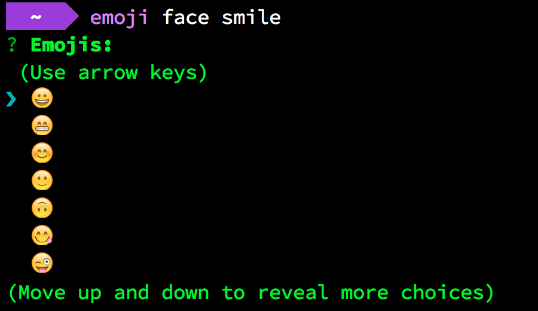

# emoji-cli
Emoji searcher

## install
via npm
```
$ npm install -g emoji-cli
```

## usage
See `emoji -h`
```
Usage: emoji <keyword>

Options:

  -h, --help     output usage information
  -V, --version  output the version number
  -r, --random   pick a emoji randomly and copy it to clipboard
```

## screenshots
One result


Multiple results


Pick a emoji randomly


Emoji not found


## based on
Thanks :exclamation:
+ https://github.com/muan/emoji-cli
